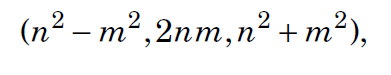

## 1. Floating Error
- Chọn epsilon = 10^(-9):

```C++
if (a - b) < 1e-9 {
    // a equal b
}
```
## 2. Shortening Code:
```C++
typedef long long ll;
typedef vector<int> vi; 
```
```C++
#define PB push_back
v.PB(1); // v.push_back(1);

#define REP(i,a,b) for (int i = a; i <= b; i++)
REP(i,1,n) {
    search(i);
}

#define SQ(a) (a)*(a);
cout << SQ(3+3) << "\n";
```
## 3. Mathematics

- Cấp số cộng:


- Cấp số nhân:

- Công thức Binet tính số Fibonacci thứ n:

- Phân tích 1 số ra thừa số nguyên tố

```C
vector<int> factors(int n) {
    vector<int> f;
    for (int x = 2; x*x <= n; x++) {
        while (n%x == 0) {
            f.push_back(x);
            n /= x;
        }
    }
    if (n > 1) f.push_back(n);
    return f;
}
```
- Số lượng các thừa số của một số

- Tổng các thừa số của một số

- Tích các thừa số của một số

- Sàng Eratosthenes
```C
for (int x = 2; x <= n; x++) {
    if (sieve[x]) continue;
    for (int u = 2*x; u <= n; u += x) {
        sieve[u] = x;
    }
}
```
- Thuật chia Euclid:

```C
int gcd(int a, int b) {
    if (b == 0) return a;
    return gcd(b, a%b);
}
```
- Số các số nguyên tố cùng nhau từ 1 đến n

- Phép chia modulo của số mũ

```C
int modpow(int x, int n, int m) {
    if (n == 0) return 1%m;
    long long u = modpow(x,n/2,m);
    u = (u*u)%m;
    if (n%2 == 1) u = (u*x)%m;
    return u;
}
```
- Công thức Euclid cho bộ ba số Pytago

- Công thức Wilson: số n là số nguyên tố khi:

- Tổ hợp

- 
## 4. Độ phức tạp thời gian yêu cầu đối với các đầu vào khác nhau:

## 5. Sắp xếp:
```C++
sort(v.begin(), v.end()); // Ascending
sort(v.rbegin(), v.rend()); // Descending
```
## 6. Set:
- *set, unordered_set, multiset, unordered_multiset* 
```C++
set<int> s;
s.insert(1);
s.size()
s.count(1);

for (auto x : s) {
cout << x << "\n";
}
```
## 7. Map:
```C++
map<string, int> number;
number['One'] = 1;
number.count("One");

for (auto x : m) {
    cout << x.first << " " << x.second << "\n";
}
```
## 8. Bitset
```C++
biset<10> s; 
s[1] = 0; 
s[2] = 1;
bitset<10> s(string("0010011010")); // from right to left
```
## 9. Deque
```C
deque<int> d;
d.push_back(1);
d.push_front(2);
d.pop_back();
d.pop_front();
```
## 10. Stack
```C
stack<int> s;
s.push(1);
s.pop();
s.top();
```
## 11. Queue
```C
queue<int> q;
q.push(1);
q.pop();
q.front();
```
## 12. Dynamic Programming (Memoization)
Segment Tree

# III. Graph:
## Adjacent List:
- Đồ thị không có trọng số:

```C
vector<int> adj[N]

adj[1].push_back(2);
adj[2].push_back(3);
adj[2].push_back(4);
adj[3].push_back(4);
adj[4].push_back(1);
```
- Đồ thị có trọng số:

```C
vector<pair<int,int>> adj[N];
adj[1].push_back({2,5});
adj[2].push_back({3,7});
adj[2].push_back({4,6});
adj[3].push_back({4,5});
adj[4].push_back({1,2});
```
- Vòng lặp
```C
for (auto u : adj[s]) {
// process node u
}
```
## Adjacent Matrix
 
```C
int adj[N][N];
```
## Edge List
- Không trọng số
```C
vector<pair<int,int>> edges;
edges.push_back({1,2});
edges.push_back({2,3});
edges.push_back({2,4});
edges.push_back({3,4});
edges.push_back({4,1});
```
- Có trọng số
```C
vector<tuple<int,int,int>> edges;
edges.push_back({1,2,5});
edges.push_back({2,3,7});
edges.push_back({2,4,6});
edges.push_back({3,4,5});
edges.push_back({4,1,2});
```
## Depth-first search (DFS)
```C
vector<int> adj[N];
bool visited[N];
void dfs(int s) {
    if (visited[s]) return;
    visited[s] = true;
    // process node s
    for (auto u: adj[s]) {
        dfs(u);
    }
}
```
## Breadth-first search(BFS)
```C
vector<int> adj[N];
queue<int> q;
bool visited[N];
int distance[N];
visited[x] = true;
distance[x] = 0;
q.push(x);
while (!q.empty()) {
    int s = q.front(); q.pop();
    // process node s
    for (auto u : adj[s]) {
        if (visited[u]) continue;
        visited[u] = true;
        distance[u] = distance[s]+1;
        q.push(u);
    }
}
```
## Shortest Distance:
- Bellman–Ford algorithm
```
for (int i = 1; i <= n; i++) distance[i] = INF;
distance[x] = 0;
for (int i = 1; i <= n-1; i++) {
    for (auto e : edges) {
    int a, b, w;
    tie(a, b, w) = e;
    distance[b] = min(distance[b], distance[a]+w);
    }
}
```
- Dijkstra’s algorithm
```C
for (int i = 1; i <= n; i++) distance[i] = INF;
distance[x] = 0;
q.push({0,x});
while (!q.empty()) {
    int a = q.top().second; q.pop();
    if (processed[a]) continue;
    processed[a] = true;
    for (auto u : adj[a]) {
        int b = u.first, w = u.second;
        if (distance[a]+w < distance[b]) {
            distance[b] = distance[a]+w;
            q.push({-distance[b],b});
        }
    }
}
```
- **Floyd–Warshall algorithm**
```C
// Khoi tao khoang cach dung ma tran ke
for (int i = 1; i <= n; i++) {
    for (int j = 1; j <= n; j++) {
        if (i == j) distance[i][j] = 0;
        else if (adj[i][j]) distance[i][j] = adj[i][j];
        else distance[i][j] = INF;
    }
}

// Floyd–Warshall algorithm
for (int k = 1; k <= n; k++) {
    for (int i = 1; i <= n; i++) {
        for (int j = 1; j <= n; j++) {
            distance[i][j] = min(distance[i][j];
            distance[i][k]+distance[k][j]);
        }
    }
}
```
# Tree
## Duyệt qua cây
```C
void dfs(int s, int e) {
    // process node s
    for (auto u : adj[s]) {
        if (u != e) dfs(u, s);
    }
}

dfs(x, 0);
```
## String Hashing

- Chọn B = 1e9

## Geometry
- Công thức Heron

- Diện tích của hình đi qua 4 điểm

- Số phức
```C
typedef long long C;
typedef complex<C> P;
#define X real()
#define Y imag()
P p = {4, 2}
// The function arg(v) calculates the angle of a vector v Æ (x, y) with respect to
the x axis.
// The function polar(s,a) constructs a vector whose length is s and that points
to an angle a.
P v = {4,2};
cout << arg(v) << "\n"; // 0.463648
v *= polar(1.0,0.5);
cout << arg(v) << "\n"; // 0.963648
```
- Diện tích đa giác


- 
